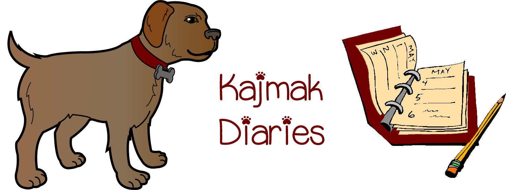

- 6th February 2022

I am still at the dog pound and I am still waiting for someone to pick me up. This place is a hell hole and I am tired of sharing a cell with bulldog and sausage dog over here. I hope someone will pick me up for real, not like the empty promises I get everyday from these weird women that love animals too much. They said I am about to meet my new owner tomorrow, we shall see...

- 7th February 2022

I am finally getting out of this joint and going somewhere else. I hope my new owner is not a fucking weirdo and that I am going to a normal place. I was super happy to see my new owner is a regular dude and not some psycho, everything was ready at the place I arrived, and I was not expecting this at all to be honest. The only problem is that I didn't know where the dog's restroom was, so I figured i just piss and shit on the floor. And guess what, the guy just started cleaning my stuff and smiling at me. What a dork.

- 8th February 2022
After my first night of sleep everything still felt weird. I was no longer in the cell and was free to roam around an apartment. He got me some toys (I don't understand what is his obsession with the blue color), and got me some nice food. I no longer have to eat that crap from the shelter. Besides that, the day was pretty chill, he kept staring at three illuminated squares all day and talking to wall. What a weirdo.

- 9th February 2022
The guy left the house today and didn't say anything. I mean, the least you can do is warn someone and let them know where you headed. For just a couple of hours, but still... After that, he finally took me outside but still inside the apartment complex. I didn't see anyone, this place looks like a ghost town. 

- Dia 10 de fevereiro de 22
- Hoje fiquei com soluços, acho que tive frio ou comi muito depressa.
Estou sempre à espera para comer. Gosto de o desafiar.
- Dia 11 de fevereiro de 22
Já se tornou rotina ir à rua para fazer as minhas necessidades.
Adoro brincar com o meu dono. 
- Dia 12 de fevereiro de 22
 Hoje foi a minha primeira visita ao veterinário. 
Engoli umas gotas desagradáveis. Dei um belo passeio.
- Dia 13 de fevereiro de 22
Fui passear à rua e todos perguntavam ao meu dono. 
O meu nome e a minha idade.
Hoje vomitei pela primeira vez e tomei o meu primeiro banho
- Dia 14 de fevereiro de 22
O entusiasmo foi tanto que deu asneira...aconteceu um rasgão nas calças do meu dono...
- Dia 15 de fevereiro de 22
Joguei a bola com o meu dono e desafiei um cao na rua
